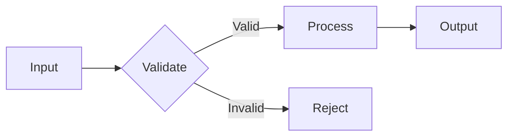

# Visual Companion

## Principle

When explaining complex systems, data flows, or architectures, provide a visual representation. Text alone is often insufficient for understanding multi-step processes.

## When to Use

- Architecture overviews (system components and their relationships)
- Data flow diagrams (how data moves through the system)
- State machine diagrams (state transitions)
- Sequence diagrams (interaction order between components)
- Decision trees (branching logic)

## Tools

Prefer these formats:
- **Mermaid** — for in-document diagrams (flowcharts, sequence, state, class)
- **ASCII art** — for simple relationships in code comments or terminal output
- **Graphviz/DOT** — for complex graphs

## Examples

### Mermaid Flowchart


### ASCII State Machine
```
[IDLE] -- receive msg --> [PROCESSING] -- done --> [IDLE]
  |                          |
  v                          v
[ERROR] <-- fail ------ [TIMEOUT]
```

## Anti-Patterns

- Don't generate images that can't be rendered in the conversation
- Don't over-diagram simple concepts (a 3-line function doesn't need a flow chart)
- Don't use multiple diagram types for the same concept
